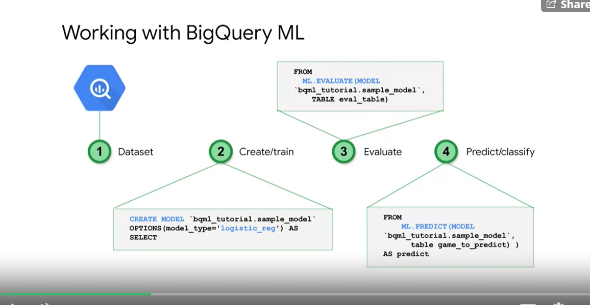
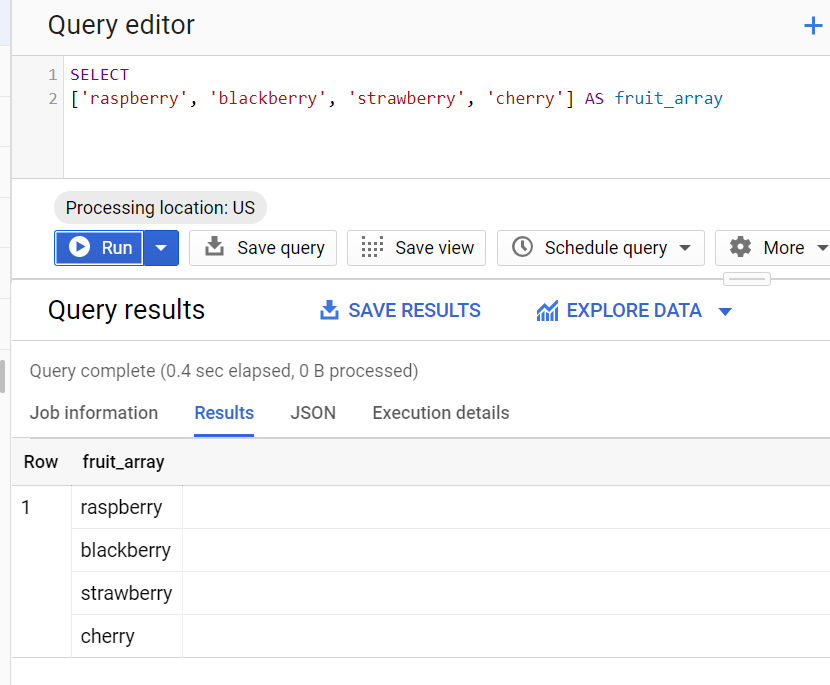

# API 

## Python
[list of python API here](https://cloud.google.com/python/docs/reference)

## Errors

[error codes here ](https://cloud.google.com/apis/design/errors)


# Client SDK

* you always need scopes when working with SDK
* list of scopes [here](https://developers.google.com/identity/protocols/oauth2/scopes)

# Service Accounts

* if you delete a service acct that you did not create from the IAM roles  page, try to recover using these steps 

head [here]
Service Acct > find the sa in question > UNIQUE_ID

make a POST request with an empty body
https://content-iam.googleapis.com/v1/projects/[PROJECT HERE]/serviceAccounts/[UNIQUE_ID_HERE]:undelete?alt=json&key=[API key here]

if sucessful you get a 200 back


* otherwise toss the project its corrupted

* __default Compute Engine service account__ [PROJECT_NUMBER]-compute@developer.gserviceaccount.com


# Cloud Shell

* to set the project 
```bash
gcloud config set project [PROJECT_ID]
```

* to get project id 
```bash
gcloud config get-value project
```

* to get ip addr of yr cloud shell
```bash
$(wget -qO - http://ipecho.net/plain)/32
```

## storage

* to make a storage bucket

```bash
gsutil mb -p [PROJECT NAME] -c [STORAGE CLASS] -l [LOCATION] gs://[NAME ]
```

* to copy big items to storage
```bash
gsutil -m cp -r GB_folder   gs://my_notebook 
```

## Service Accounts

*to create a service acct with its private key
```bash
gcloud config set project [PROJECT ID]

export PROJECT=<your_project_name>

gcloud iam service-accounts create my-account --display-name my-account
gcloud projects add-iam-policy-binding $PROJECT --member=serviceAccount:my-account@$PROJECT.iam.gserviceaccount.com --role=roles/bigquery.admin
gcloud iam service-accounts keys create key.json --iam-account=my-account@$PROJECT.iam.gserviceaccount.com
export GOOGLE_APPLICATION_CREDENTIALS=key.json
```

* to list service accts
```bash
gcloud --project=$PROJECT_ID iam service-accounts list
```

* to enable an API

```bash
gcloud services enable [API NAME]
```

* to see all availbe API
```bash
gcloud services list --available
```

* to create a storage bucket
```bash
gsutil mb gs://[<<BUCKET_NAME(MUST BE UNIQUE)>>]
# example
# gsutil mb gs://kubeflow-qwiklabs-gcp-01-1a614bf66a2b
```


## Big Query

* to create a bigquery dataset 
```bash
bq mk --dataset [DATA SET NAME HERE] 
```

* to load data from cloud storage
```bash
bq load \
--source_format=CSV \
--autodetect \
--noreplace  \
nyctaxi.2018trips \
gs://cloud-training/OCBL013/nyc_tlc_yellow_trips_2018_subset_2.csv
```

* to list datasets 
```bash
bq ls
```

* to make a table
```bash
bq mk \
--time_partitioning_field timestamp \
--schema [your columne schema here] -t taxirides.realtime
```

## Cloud SQL

* to login to your database cluster
```bash
gcloud sql connect rentals --user=root --quiet

mysql --host=$MYSQLIP --user=root \
      --password --verbose
```

* import data 
```bash
mysqlimport --local --host=$MYSQLIP --user=root --password \
--ignore-lines=1 --fields-terminated-by=',' bts trips.csv-*
```


* to creata a cloud sql instance
```bash
gcloud sql instances create taxi \
    --tier=db-n1-standard-1 --activation-policy=ALWAYS
```

* set root password for cloud sql instance
```sql
gcloud sql users set-password root --host % --instance taxi \
 --password Passw0rd
```

* whitelist an ip to access cloud sql
```sh
gcloud sql instances patch taxi --authorized-networks $ADDRESS
```


## Dataproc

* to create a dataproc cluster
```sql
gcloud dataproc clusters create cluster-dqm01 \
  --region us-central1 \
  --zone us-central1-a \
  --master-machine-type n1-standard-4 \
  --master-boot-disk-size 500 \
  --num-workers 2 \
  --worker-machine-type n1-standard-4 \
  --worker-boot-disk-size 500 \
  --image-version 1.3-deb9 \
  --project xxxxxx \
  --service-account xxxx.iam.gserviceaccount.com

gcloud dataproc clusters create rentals \
  --region us-central1 \
  --zone us-central1-a \
  --master-machine-type n1-standard-4 \
  --master-boot-disk-size 500 \
  --num-workers 2 \
  --worker-machine-type n1-standard-4 \
  --worker-boot-disk-size 500 \
  --image-version 1.3-deb9 \
  --project gcp-data-certification-288008 
```


# Big Query

* can stream data
* pay for stored data 
* for streaming or real-time data, use cloud dataflow
* up to certain terabytes free per month


|property|value|data|
|:------|:------:|------|
|Aggregate functions| COUNT(),SUM(),AVG(),MIN(),MAX(),ROUND(),ARRAY_AGG(),ARRAY_LENGTH()|use GROUP BY on the non aggregated colums to get it to work|
|EXTRACT(x from date) where x is|DATE,WEEKOFDAY,HOUR||
|WITH|WITH memory_table AS ([SQL QUERY])|make an in memory table just for one SQL query help with joins, so you dont join bigger tables|
|IF,COUNTIF|x(CONDITION,TRUE RETURN,FALSE RETURN)|good if a value is empty return 0 instead of null to avoid complicated transformations and breaking the app|
|UNNEST()|brings arrays back into rows  always follows the table name in your FROM clause |SELECT person, f, total_cost FROM `data-to-insights.advanced.fruit_store`,UNNEST(fruit_array) AS f|


* to create a model



* to parse thise string

- "Adventure|Children|Fantasy"
```sql
CREATE OR REPLACE TABLE
  movies.movielens_movies AS
SELECT
  * REPLACE(SPLIT(genres, "|") AS genres)
FROM
  movies.movielens_movies_raw
```

* to hear all recommendations about a model
```sql
SELECT
  *
FROM
  ML.RECOMMEND(MODEL `cloud-training-prod-bucket.movies.movie_recommender`)
LIMIT 
  100000
```

* to create an array


* to query an item from an array
```sql
    SELECT
      movieId,
      title,
      903 AS userId,
      genres
    FROM
      `movies.movielens_movies`,
      UNNEST(genres) g
    WHERE
      g = 'Comedy' 
```


*  to select structs
    * can also remove the .*
```sql
SELECT
  visitId,
  totals.*,
  device.*
FROM `bigquery-public-data.google_analytics_sample.ga_sessions_20170801`
WHERE visitId = 1501570398
LIMIT 10
```

* to create a struct
```sql
#standardSQL
SELECT STRUCT("Rudisha" as name, 23.4 as split) as runner
```

* to reference a table a previous point in time
```sql
    SELECT *
    FROM `demos.average_speeds`
    FOR SYSTEM_TIME AS OF TIMESTAMP_SUB(CURRENT_TIMESTAMP, INTERVAL 10 MINUTE)
    ORDER BY timestamp DESC
    LIMIT 100
```

* to create a partitioned table
```sql
CREATE OR REPLACE TABLE ecommerce.partitions
    PARTITION BY date_formatted
    OPTIONS ( 
        description="a table partitioned by date"
    ) AS

    SELECT 
        COUNT(transactionId)
        PARSE_DATE("%Y%m%d",date) AS  date_formatted
    FROM
        'data-to-insights.ecommerce.all_sessions'
    WHERE
        transactionId IS NOT NULL
    GROUP BY date_formatted
```

# BigTable

* high performance applications
* __colossus__ where bigtable  stores data
* index with row key
* speed through simple
* nosql database
* you just want a quick scan, sorting = less performance 
* have identical data closer to each other
* if data is read more than others, colusses reorganizes for optimization
* unless yr in prod with TB+ data use bigquery 


# Dataflow

## Dataflow Windowing

* 3 types fixed sliding and session
* in python late data is discarded  in java u can do something about late data

# AutoML 

* csv must be in same bucket as source files
* how long models remain depends on model ttype

* company sells clothes get emails
* model 1, clothes or businnes inquery
  * model 2 pants or shirts
    * model 3 yellow shirts or orange shirts
      * lakers jerseys or golden staten jerseys


## Auto ML Vision

* remove very low frequency level images
* if the target is at 

|target|training data should reflect|
|:------|:------:|
|day|day||
|green room|green room||
|blue item|blue item||
|human presnse|human presence||

* perfect, means not enough variety 

## Auto ML NLP

* topics of items
* max 128 kb 
* models deleted every 6 months

## Auto ML Tables

* import through big query
* 100 g or less
* get data valdiation

# Pub/Sub

 * if your system is down, Pub/Sub holds onto messages for 7 days
 * async and sync publisher
 * dont use for chat apps
 * messages may come out of order
 * only captures data, does not send it to other API
 * Use apache beam for pipelines

* pub sub workflow 


# Data Studio

* users do not see data if they dont have access in bigquery
# Cheatsheats

https://gist.github.com/pydevops/cffbd3c694d599c6ca18342d3625af97


