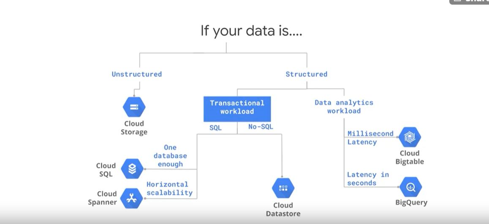
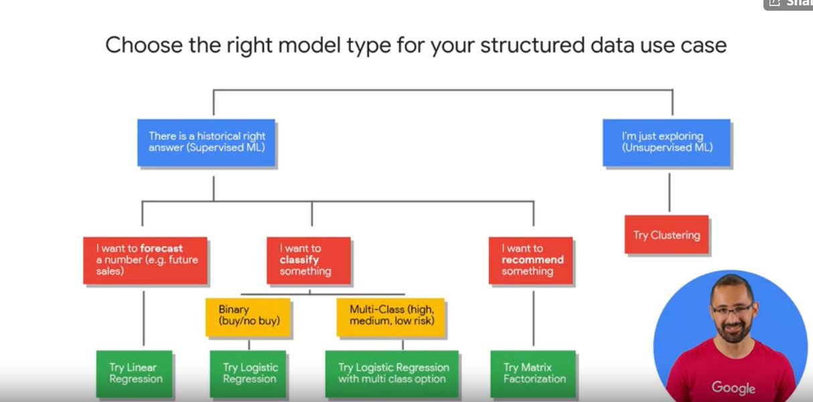

# Data cerfitifications

## Social network 

### Messages

Greetings I am currently going to get several GCP certifications. Subscribe to my youtube channel as I do tutorials on the fundamentals and advanced concepts of GCP. Any advice for  education and career prospects will be appreciated .  https://www.youtube.com/channel/UCmqEX_zasOf3AQ9vnPkxtjg/

## Coursera 


### 1 
* need a lot of compute power for big data jobs 
* for stablizing a video, lot of data 
* talking petabytes
* google uses many data centers to get things done

#### Creating a VM on Compute Engine Tutorial

* data from USGS
* plot earthquake activity

##### Steps 
* console.cloud.google.com
* menu -> compute engine -> vm instances    

| name          | value           | data 
| :------------ |:---------------:| :-----:|
|       name        | earthquakevm                 |       |
|     region          |     us-east4( Northern Virginia)            |       |
|      zone         |     us-east4-c            |       |
|      machine type     |     n1-standard 1          |     1 vCPU 3.75 GB memory  |
|        space |   10 gb 
|        OS  |   Debian GNU/Linux 9 (stretch)  
| access scopes |   Allow full access to all Cloud APIs   
|firewall | no HTTP(S)
 
* wait for the vm to be up then you can ssh by scolling to the connect column
    * theres no software
    * u have root access
* install git
* in ssh 
    * apt-get install git
    * git clone
    * git clone https://www.github.com/GoogleCloudPlatform/training-data-analyst
    * cd  training-data-analyst/courses/bdml_fundamentals/demos/earthquakevm
        * ingest.sh, gets new earthquake data and deletes old data 
        * install_missing.sh - gets all needed python packages
    * ./install_missing.sh
    * head earthquakes.csv
    * to visualize the data
        ./transform.py  
* compute and storage are seperate get the generated .png off compute and on the storage


* console.cloud.google.com
* menu -> storage -> browser -> create bucket 

| name          | value           | data 
| :------------ |:---------------:| -----:|
|     name          |  earthquake-1589660299109               |       |
|     location type          |   multi-regional                 |       |


* in ssh 
    * gsutil ls gs://earthquake-1589660299109
        * should be empty
    * gsutil cp earthquakes.* gs://earthquake-1589660299109
* refresh bucket
    * files are not publick
* we dont need the vm anymore
    * menu -> compute engine -> vm instances    
    * select machine 
        * stop 
            * pay for disk but not compute
            * good if u installed a lot of software
        * delete
            * get rid of it
    * hit stop 
* make the data public
* menu -> storage -> browser -> bucket
* select all objects 
* permissions -> add 


| name          | value           | data 
| :------------ |:---------------:| -----:|
|  new memebers               |       allUsers          |       |
|        role          |      storage object viewer           |       |
|               |                 |       |

* objects -> column[public access] -> copy url
    * u have a warning sign because it was made public


#### Elastic Storage with google cloud storage

* need a place to store all data
* compute, and storage is seperate 
* getting data into storage and transforming for purpose

##### details

* four storage classes
    * different on access speed and cost
    standard storage - fastest 
    archive storage- least expensive
* if you want to use folders u must have an organization
* gsutil uses familiar linux cmd 

#### Networking

* google builds 1,000 of fiber optics with repeaters to connect the world
* has bandwith so big 100,000 can commuicate at 10gb/s

#### Security 
* on-prem, you are responsible for security
* gcp - google handles many lower layer security
* there DOS protection, data encryption
* BiqQuery
    * petabyte data encrypted with a data encryption key, encrypted with key encryption key
    * can limit team 

#### History of managing large scale data
* 2002  GFS - to deal with petabyte data


#### Google Cloud Public Datasets program
* access 1TB data/month at no cost
* dont need to worry abt licenses all data in one place
* you got the worlds data in one place


#### Getting Started with Google Cloud Platform and Qwiklabs Tutorial


* allows you to use gcp at no cost 
* using GCP console for bigquery data
* note the lab credentials
    open google console
    use another acct ,copy paste for the lab
    use the correct acct credentials
    dont click end lab till yr done

##### Questions

* how dont I need a table for the dataset       

##### Steps 

* menu -> bigQuery
* load public dataset USA Names into bigquery
    ADD DATA -> explore public datasets -> usa names
    VIEW DATASET 
        BigQuery opens in a new tab you can see the dataset in your resources tree
    
* in query editor 
    ```sql
    SELECT
    name, gender,
    SUM(number) AS total
    FROM
    `bigquery-public-data.usa_names.usa_1910_2013`
    GROUP BY
    name, gender
    ORDER BY
    total DESC
    LIMIT
    10    
    ```
    * you learn whether the query is valid, 
    * and the amnt of data needed to get it to run 

* create a custom table
    download babynames.zip 
    read the pdf 
    note the location of yob2014.txt
    * Resources -> [GCP Project ID]  -> cREATE DATASET

    | name          | value           | data 
    | :------------ |:---------------:| -----:|
    |      Dataset ID         |     babynames            |       |
    |        Data location,       |     United States (US)            |       |
    |     Default table expiration          |      [default]           |       |
    

    * babynames -> create table

    | name          | value           | data  |
    | :------------ |:---------------:| -----:|
    |     Source  Create table from:       |      Upload           |        |
    |     Source     Selecti File      | fakepath/yob2014.txt                |       |
    |     Source     File Format       |     CSV                 |       |
    | tABLE NAME |  names_2014|
    | schema  | name:string,gender:string,count:integer   | edit as text selected|  


    * babynames ->  names_2014  -> preview tab

* query the table 

    * in query editor 
    ```sql
    SELECT
    name, count
    FROM
    `babynames.names_2014`
    WHERE
    gender = 'M'
    ORDER BY count DESC LIMIT 5
    ```


#### Choosing the right approach

* compute engine- running individual code 
* GKE - contaierized code, docker stuff,  when u got a software architecture code
* app engine - long lived web apps
* cloud functions - execute code on event file on cloud storage
* storage -> ingest -> analyze -> ml -> serve 

#### What you can do with Google Cloud Platform

* use case, AutoML , customer can search for details like granite countertops
* uses ML to routing emails to the right mailbox
* kewpie sorted discolored food


#### Explore real customer solution architectures
* cloud.google.com/customers
* filter big data analytics and ml
* select use case that interests you
* questions 
    * barries and challenges customer faced
    * how GCP solved it
    * what was the business impact    

* bloomberg
    * 1 getting data from 100 of news sources, intrepret into something ppl can understand, 40 countries 170 languages
    *  2  GCP already had the tool, integration was easy
    *  3 business impact was fantastic it was an amazing feeling for them


#### Key roles in a data-driven organization


#### Introduction to machine learning
* recommadatin
    *data, model,infrastructure
    * learning from data in an automated way
    * who is the user like 
    * Cloud SQL , few gigs 
    * Cloud Spanner more SQL



#### From zero to an Apache Spark job in 10 minutes or less

##### Steps
 
navigation menu -> dataproc -> clusters 

create cluster

| name          | value           | data 
| :------------ |:---------------:| -----:|
|     name          |        cluster-af04         |       |
|      cluster mode         |   standard (1 master N workers)              |       |


create 

dataproc -> jobs

submit a job

| name          | value           | data 
| :------------ |:---------------:| -----:|
|    job ID           |  estimate-pi-digits               |       |
|        job type       |   spark                  |       |
|        main class or jar       |      org.apache.spark.examples.SparkPi      |   |  
|  arguments     | 10 | |
| jar files |  spark/examples/jars/spark-examples.jar   |


###### Issues 
we had to stop short early not allowed to select a cluster


#### Challenge: Utilizing and tuning on-premise clusters

*  a team uses 100% of the cluster for 2 jobs
* or a team a use 10 % for 4  jobs
 * GCP is dynamic with jobs and cluster resources
 * jobs get resources they need
 * store data off cluster 

#### Move storage off-cluster with Google Cloud Storage

#### Introduction to BigQuery

* petabyte-scale fully managed data warehouse
* work best working off its own storage
* managed with SQL  
* BigQuery support  ARRAY TYPES


###### Activity Practice Exploring BigQuery Public Datasets

1 dataset name 
    austin_bikeshare
2. 
    using this SQL 
```sql
SELECT COUNT(*) AS records
FROM bigquery-public-data.austin_bikeshare.bikeshare_stations;
```

there are 96 records

3. data quality concerns
    which bike stations are out of order 

4. 
    some insights I think I can find are exact location on planet earth
    alternstive names to train station

5.  I can join with austin_311 to see how many ppl called asking about bike station locations   

##### Demo: Analyzing lightning strikes with BigQuery GIS
* GCP Marketplace -> Datasets




* theres a historical right model
    * I want to forecast future sales
        * model - linear regiression
    * I want to classify something
        * logistic regression (2 classes)
        * multi-class more than 2
    * I want to recommend something
        * matrix factorization 

Use simple models
* Simple model to get to a benchmark,
* quicker to train 
__benchmark__ -  a good result from your data


#### Predicting customer lifetime value
* high value customer or not,
* future customer with new data but we have past data
* sometimes columns are not useful to the model
* model_type is the only required options for MODEL
__ML.WEIGHTS__ - how useful a column was from 0 not needed to 1 paramoount 


- __Lab__: Predict Visitor Purchases with a Classification Model with BigQuery ML


### Modern data pipeline challenges

* scalable reliable pipelines high proiortiy
* many diiferent sources, must be organized and correct 
* variety, volumne,velocity, corruption

#### Message-oriented architectures with Cloud Pub/S

* iot devices such as delivery drivers,or temperature sensor in a lab
* Pub/Sub deal with this
* can receive messages from variety of different streams

* __topic__ - an antenna, like angular subjects
    * decoupled from each other
* Example - someone got hired 
2 Pub HR office, id tags 
4 Sub  directory,faclities, new office allocaion, account provisioning system

#### Designing streaming pipelines with Apache Beam


* pipeline design 
    * good for batch and streaming
    * SDK suuport everything I wanna do 
    * any templates, 
    USE APACHE BEAM


#### Implementing streaming pipelines on Cloud Dataflow

* implementation
    how much maintainance
    is it reliable
    hows scaling
    monitor system
    stuck with a vendor

work with these [templates](github.com/GoogleCloudPlatform/DataflowTemplates)

#### Visualizing insights with Data Studio

* just because access to dashboard, doesnt mean access to data
* when you add a data soruce, anyone might be able to see them


#### Demo: Data Studio walkthrough
* can export bigquery dataset to data studio
* start with high level key performance indicators, 
    * then breakdown

#### Lab Create a Streaming Data Pipeline for a Real-Time Dashboard with Cloud Dataflow


# Building Batch data pipelines on GCP

### Lab Building and Executing a Pipeline Graph with Data Fusion

__joiner node__ - siminlar to a SQL join
__sink__ - where you store your data

## Orchestrating work between GCP services with Cloud Composer

### DAGs and Operators

### Workflow scheduling

###  Lab An Introduction to Cloud Composer

__Airflow__ is a platform to programmatically author, schedule and monitor workflows.

__DAG__ A Directed Acyclic Graph is a collection of all the tasks you want to run, organized in a way that reflects their relationships and dependencies.

__Operator__ The description of a single task, it is usually atomic. For example, the BashOperator is used to execute bash command.

__Task__ A parameterised instance of an Operator; a node in the DAG.

__Task Instance__ A specific run of a task; characterized as: a DAG, a Task, and a point in time. It has an indicative state: running, success, failed, skipped, ...

## Cloud Dataflow

* batch and stream with dataflow

## Why customers value Dataflow

* intelligent watermarking

## Building Cloud Dataflow Pipelines in code

### Lab A simple Dataflow pipeline (Python)

* about grep.py
    all /javahelp/src/main/java/com/google/cloud/training/dataanalyst/javahelp/ java files are input files
    the search term is 'import'
    the output goes to /tmp/prefix

### Lab Serverless Data Analysis with Dataflow: MapReduce in Dataflow (Python)

### Serverless Data Analysis with Dataflow: Side Inputs 

file cd ~/training-data-analyst/courses/data_analysis/lab2/python
nano JavaProjectsThatNeedHelp.py


# Building Resilient Streaming Analytics Systems on GCP

## Processing Streaming Data
* we stream to get real time to see the state of the business

### Lab Publish Streaming Data into Pub/Sub


## Streaming Data Challenges

## Streaming into BigQuery and Visualizing Results

* must have correct permission to connect bigquery to data studio

## High-Throughput Streaming with Cloud Bigtable

* high throughput ? bigtable
* high

## GIS Functions

* always create descriptions for your columns
* __GeoViz__ web graph front end    
* __GIS__ - Geographical Information Systems

## WITH Clauses vs Permanent Tables

* help with asyncc

### Lab Optimizing your BigQuery Queries for Performance

* adding 3 # is slowing than adding 2 ## becuase more data is read not the operation
* more column in SELECT is not good
* cache queries for 24 hrs, free

* no cache if
    * unstable result
    * table has changed
    * query is not ===
    * streams 
    * uses DML
    * external data

* place views in tables
* BI Engine  helps with caching
* avoid joins
* __denormalized__ give up on storing data efficiently, and instead add redundant copies of data.
* avoid overwhelming worker memory to “resources exceeded" error
* BigQuery provides fast, low-memory approximations of aggregate functions. Instead of using __COUNT(DISTINCT …)__,  use __APPROX_COUNT_DISTINCT__ on large data streams when a small stat uncertainty in the result is ok. 

#### Performance Considerations Cheatsheet

* avoid unneded columns
* some fn are faster than others
* filter early and often
* outermost query
* largest table on the left 
* wildcards to query multiple tables
* low cardinatliy is faster than high cardinatliy
* time partition for easier search 

### Lab Creating Date-Partitioned Tables in BigQuery 

* Common use-cases for date-partitioned tables
    * All transactions for the last year
    * All visitor interactions within the last 7 days
    * All products sold in the last month

* you need your partitioned tables to expire, you will be charged for them

### Streaming Data Processing: Streaming Data Pipelines

* how many elements the pipeline processes per second,
* system lag
*  how many data elements have been processed so far

 Navigation menu >  Dataflow > [PROJECT ID] job >  Get messages node


# Smart Analytics, Machine Learning, and AI on GCP

## What is ML?

__ML__ - using algorithms to make predicitve insights from data and make repeated decisions. A type of AI

__deep learning__ - ML on unstructed data, aka images,speech

playgroud.tensorflow.org