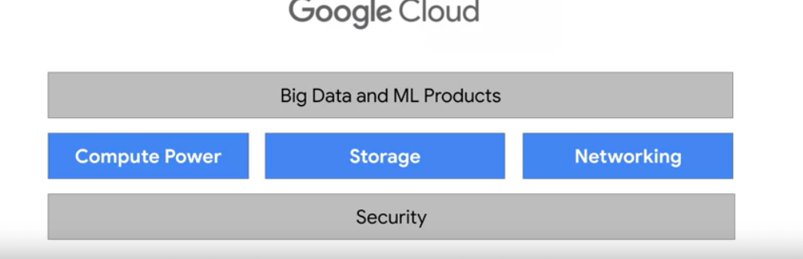
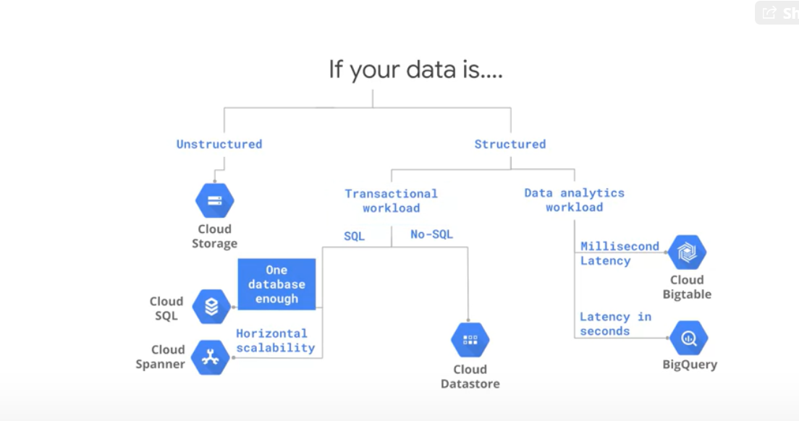
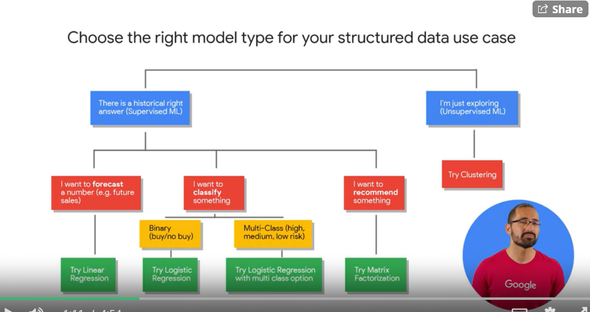
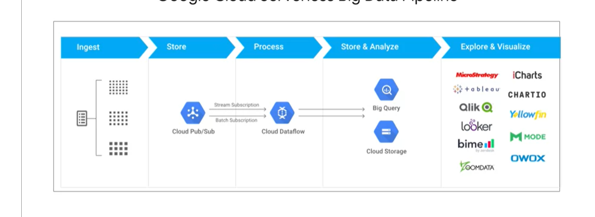
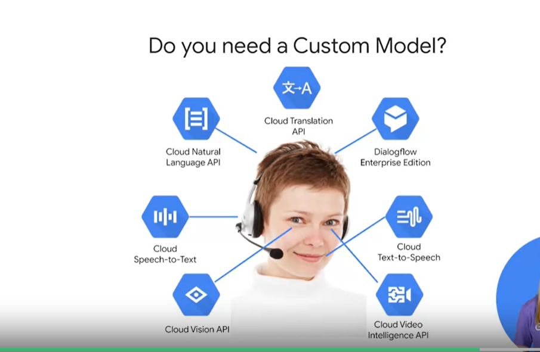
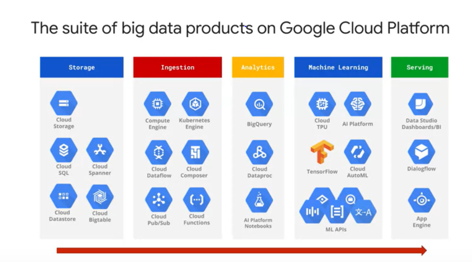
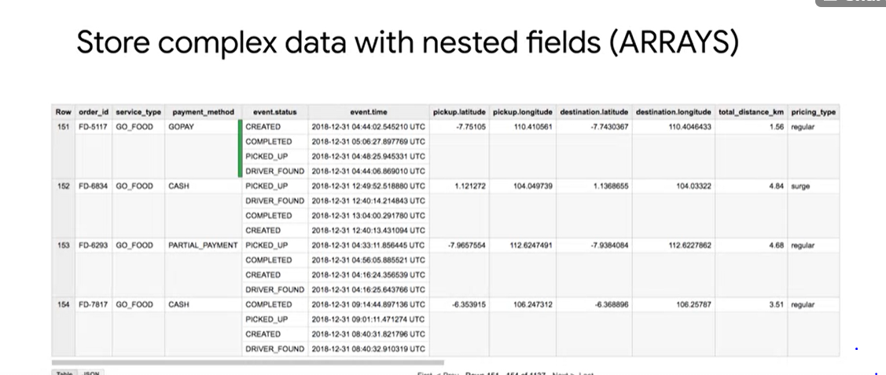
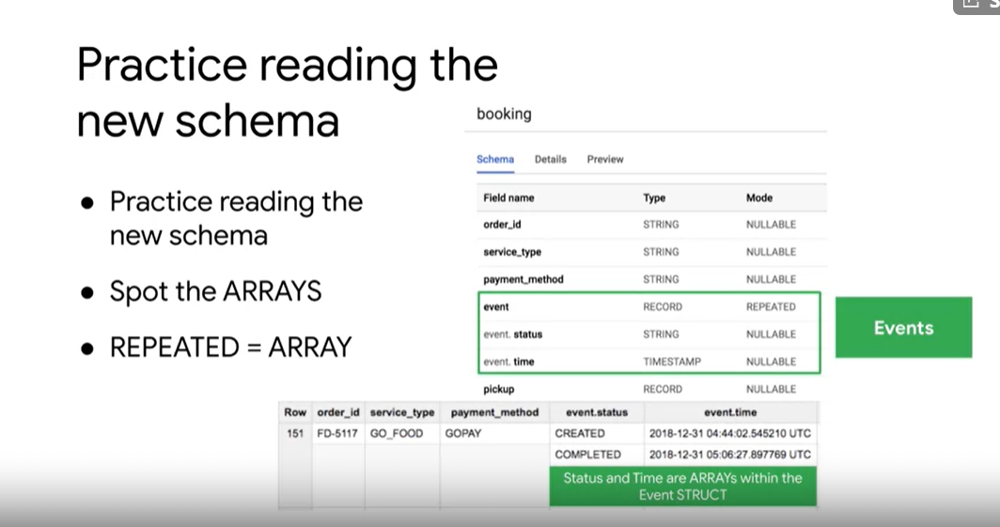

# Data Engineering, Big Data, and Machine Learning on GCP

## Social network 

### Messages

Greetings I am currently going to get several GCP certifications. Like share Subscribe to my youtube channel as I do tutorials on the fundamentals and advanced concepts of GCP. Any advice for  education and career prospects will be appreciated .  https://www.youtube.com/channel/UCmqEX_zasOf3AQ9vnPkxtjg/

## Google Cloud Platform Big Data and Machine Learning Fundamentals

### Introduction to Google Cloud Platform

* project has over 1 billon users, growing userbase 
* 4 aspects ,  

### Compute Power for Analytic and ML Workloads

* need lots of compute power
* google photos to stablize requires 1 billion data into the model
* __TPU__ - better CPU made for ML 

### Elastic Storage with Google Cloud Storage

* differ on speed and cost 
__project__ base level for using services
__zones__ physically organize resources and services
__folders__ - a bunch of projects, must have an organization
__organization__ - a bunch of folders

### Build on Google's Global Network

* 10 GBPS 

### Security: On-premise vs Cloud-native

### Lab Exploring a BigQuery Public Dataset

### Choosing the right approach

__Kubernetes__ - orchestrate code running in containers
__Cloud Functions__ - runs in reaction to event, new file hitting cloud storage

### What you can do with Google Cloud Platform
* use ML to recongize if a room is funrished 

### Key roles in a data-driven organization

### How businesses use recommendation systems

__Dataproc__ - managed env to run Apache Spark
* youtube is a recommendation system

### Introduction to machine learning

* core pieces of recommendation
    * data 
    * model
    * infrasturucture to use

* ml, let the model decide

### Challenge: ML for recommending housing rentals

* get ratings from all users
* training machine model to predict users rating for every house
* parameters
    * the users are most likely to take 
    * the users might not have anything in common to the user in questions, say target is art and sample like sports
    * is a house highly rated objectively
* how often and where will u will hold the data
* apache hadoop, 1000 of items 1000000 of users data done in a fault tolerant way

### Approach: Move from on-premise to Google Cloud Platform
* storage - global fs
* bigtable- sensor data
* bigquery - for ananlytics

### Demo: From zero to an Apache Spark job in 10 minutes or less

### Challenge: Utilizing and tuning on-premise clusters

* cloud dataproc autoscaling, for the varying needs of the job
* __PVM, Preemptible VM__   short lived vm for batch jobs and fault tolerant work. 80% cheaper than regular vm

### Move storage off-cluster with Google Cloud Storage
* shut down cluster resurces you dont need

### Lab: Recommend products using Cloud SQL and SparkML

### Choosing a ML model type for structured data

* start with simple model, help determine if ML is a good solution for the problem

### Predicting customer lifetime value

* approximate reality based on what you do know

### BigQuery ML: key features walkthrough

* __ML.EVALUATE__ - inspect how good a model is on the test
* use the same columns in created model to predict or u get an error

### Lab Predicting Visitor Purchases with a Classification Model with BigQuery ML

* __ROC__ -  Receiver Operating Characteristic for classification we want to minimize the False Positive Rate  maximize the True Positive Rate, this is the metric that measures the model against that goal

## Modern data pipeline challenges

* variety or data sources
* volumne
* transformations

### Message-oriented architectures with Cloud Pub/Sub

 * Use apache beam for pipelines

 * __Apache beam__ - portable data processing program model, extensible
 * __serverless__ - low-maintenance
 * [templates](github.com/GoogleCloudPlatform/DataflowTemplates)

### Visualizing insights with Data Studio

* focus on highliths end users need to see

### Lab Create a Streaming Data Pipeline for a Real-Time Dashboard with Cloud Dataflow

## Where is unstructured ML used in business?

* how does ML learn unstructed data
* __dialogflow__ - chatbot dialog ML the GCP offers
* several ML model API

### Using pre-built AI to create a chatbot

* __dialogflow__ - chatbot dialog ML the GCP offers, its the standard
    * idenitify entities
    * understand emotion in a block of text
    * agents, that get trained
        * train or use pre builts
        * 

### Customizing Pre-built models with AutoML

### Lab Classifying Images of Clouds in the Cloud with AutoML Vision

## Building a Custom Model

*  [bigquery ML](https://cloud.google.com/bigquery/docs/bigqueryml-intro)
*  [auto ML](https://cloud.google.com/automl/)
*  [tensorflow ML](https://www.tensorflow.org/tutorials/)

# Modernizing Data Lakes and Data Warehouses with GCP

## Explore the role of a data engineer

* __data engineer__ builds data pipelines
* pipeline, make data-driven decisions
* __data lake__ - data across enterprise stored in data lake
    * can I access my data lake easy

### Analyze data engineering challenges

* difficult to access data
* not good daa
* cant transform, query
__data warehouse__ - clean data very efficient to query
    * bigquery is the data warehouse
*  do cleanup once, and store as needed
* compuation problems, got to wrestle for resources and make sure the software is orchestrated

* to do a federated query for google spreadsheet in bigquery
    * look for google spreadsheet when creating the table copy the spreadsheet url 
    write out yr schema thts it, good to go for data studio

* cloud sql is for writing 
* big query is for analytics
* who cares use bigquery and go home, its gunna be better than cloud sql anyway

### Partner effectively with other data teams

* other teams want yr data, must prepare it for them and use best practices

### Manage data access and governance

* setup data access, security
* hows PII handled
* data catalog + 
* __DLP API__ - managed sensitive data

### Build production-ready pipelines

* automate and optimize
* __cloud composer__ GCP's own apache airflow this is pipeline orchestration

### Lab Using BigQuery to do Analysis

## Introduction to Data Lakes

### civil engineering 

* bringing the raw materials to skyscraper site 
    * data from various ioT

* cut glass, shape metal    
    * transform raw to data warehouse

* how to transform to use pieces, is the worker, 
    * the API or framework helping use

* manager, masonry manager
    * orchestration cloud composer

### Data Storage and ETL options on GCP

* get warehouse once you have a use case a schema defined
* __EL__ - data is clean ready to go
* __ELT__ - transform in GCP, just needed a quick filter
* __ETL__ - transform before GCP

### Securing Cloud Storage

### The Modern Data Warehouse

### Loading Data

### Demo: Exploring Schemas

* many ways you can reogranize data for better query performance
* Nested and repeated fields are the way to go

### Nested and Repeated Fields

* repeated data in structs and arrays is faster, nested and repeated

* __structs__ - standardSQL, subtables in a table
    * structs can have other sturcts inside of it
    * structs TYPE = RECORD
    * sturcts are colums

* __arrays__ - MODE - REPEATED
    * rows with in a row
    * the data mus be the same type

