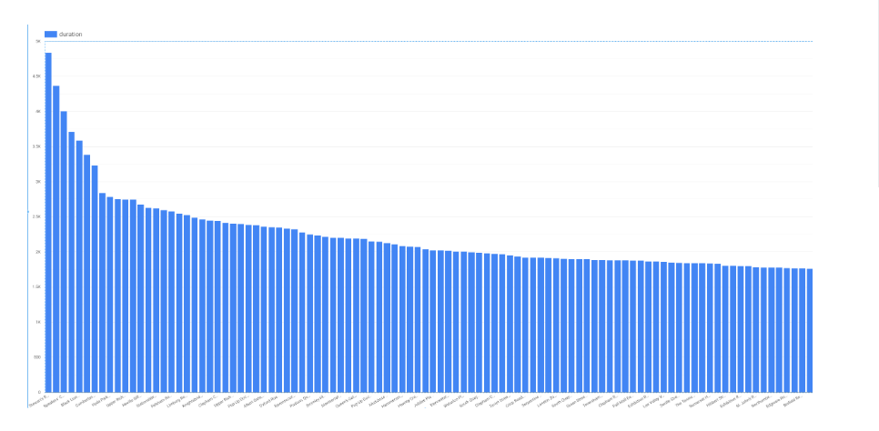
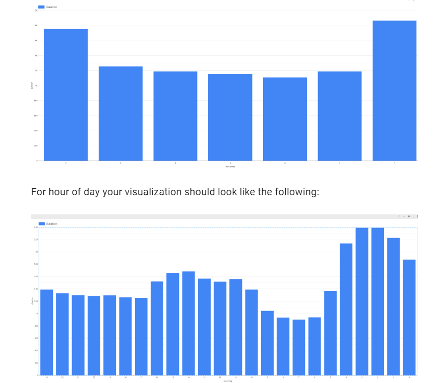

# Predict Bike Trip Duration with a Regression Model in BQML

## Explore bike data for feature engineering

* to predict the duration of a rental based on our historical dataset of cycle rentals, the label is the duration of the rental.

* If we believe that the duration will vary based on the station the bicycle is being rented at, the day of the week, and the time of day, those could be our features.

### Impact of station


nav menu > bigquery > query editor 

*  check whether the duration of a rental varies by station,
```sql
SELECT
  start_station_name,
  AVG(duration) AS duration
FROM
  `bigquery-public-data`.london_bicycles.cycle_hire
GROUP BY
  start_station_name
```

run 
explore data > data studio

chose the bar chart 


|property|value|data|
|:------|:------:|------:|
|data >dimension|start_station_name||
|style > bars    |100||
|||

result



as we can see we cant use station name to come to a conclusion

### Impact of day of week and hour of day

* to get duration by day of week
* then go ahead and repeat in data studio
```sql
SELECT
  EXTRACT(dayofweek
  FROM
    start_date) AS dayofweek,
  AVG(duration) AS duration
FROM
  `bigquery-public-data`.london_bicycles.cycle_hire
GROUP BY
  dayofweek
```



we see more bike rdes in the weekends, and highest in thevening

### Impact of number of bicycles

* number of bikes
```sql
SELECT
  bikes_count,
  AVG(duration) AS duration
FROM
  `bigquery-public-data`.london_bicycles.cycle_hire
JOIN
  `bigquery-public-data`.london_bicycles.cycle_stations
ON
  cycle_hire.start_station_name = cycle_stations.name
GROUP BY
  bikes_count
```

* number of bikes is not a good feature

## Create a training dataset

* aka create a table for your model
```sql
SELECT
  duration,
  start_station_name,
  CAST(EXTRACT(dayofweek
    FROM
      start_date) AS STRING) AS dayofweek,
  CAST(EXTRACT(hour
    FROM
      start_date) AS STRING) AS hourofday
FROM
  `bigquery-public-data`.london_bicycles.cycle_hire
```

big queury > [project id] > create dataset 

|property|value|data|
|:------|:------:|------:|
|Dataset ID|bike_model||
|Data location|European Union (EU)||


* create a model 
```sql
CREATE OR REPLACE MODEL
  bike_model.model
OPTIONS
  (input_label_cols=['duration'],
    model_type='linear_reg') AS
SELECT
  duration,
  
  start_station_name,
  CAST(EXTRACT(dayofweek
    FROM
      start_date) AS STRING) AS dayofweek,
  CAST(EXTRACT(hour
    FROM
      start_date) AS STRING) AS hourofday
FROM
  `bigquery-public-data`.london_bicycles.cycle_hire
```


* see the results
```sql
SELECT * FROM ML.EVALUATE(MODEL `bike_model.model`)
```

## Improving the model through feature engineering

* Build a BigQuery ML model with the combined days of week feature using the following query:

```sql
CREATE OR REPLACE MODEL
  bike_model.model_weekday
OPTIONS
  (input_label_cols=['duration'],
    model_type='linear_reg') AS
SELECT
  duration,
  start_station_name,
IF
  (EXTRACT(dayofweek
    FROM
      start_date) BETWEEN 2 AND 6,
    'weekday',
    'weekend') AS dayofweek,
  CAST(EXTRACT(hour
    FROM
      start_date) AS STRING) AS hourofday
FROM
  `bigquery-public-data`.london_bicycles.cycle_hire
```

* Bucketize hour of day

 (-inf,5), [5,10), [10,17), and [17,inf).

```sql
CREATE OR REPLACE MODEL
  bike_model.model_bucketized
OPTIONS
  (input_label_cols=['duration'],
    model_type='linear_reg') AS
SELECT
  duration,
  start_station_name,
IF
  (EXTRACT(dayofweek
    FROM
      start_date) BETWEEN 2 AND 6,
    'weekday',
    'weekend') AS dayofweek,
  ML.BUCKETIZE(EXTRACT(hour
    FROM
      start_date),
    [5, 10, 17]) AS hourofday
FROM
  `bigquery-public-data`.london_bicycles.cycle_hire
```

## Make predictions

* Build a BigQuery ML model with the TRANSFORM clause that incorporates the bucketized hour of day, and combined days of week features using the query below:

```sql
CREATE OR REPLACE MODEL
  bike_model.model_bucketized TRANSFORM(* EXCEPT(start_date),
  IF
    (EXTRACT(dayofweek
      FROM
        start_date) BETWEEN 2 AND 6,
      'weekday',
      'weekend') AS dayofweek,
    ML.BUCKETIZE(EXTRACT(HOUR
      FROM
        start_date),
      [5, 10, 17]) AS hourofday )
OPTIONS
  (input_label_cols=['duration'],
    model_type='linear_reg') AS
SELECT
  duration,
  start_station_name,
  start_date
FROM
  `bigquery-public-data`.london_bicycles.cycle_hire
```

* With the TRANSFORM clause in place, enter this query to predict the duration of a rental from Park Lane right now (your result will vary):

```sql
SELECT
  *
FROM
  ML.PREDICT(MODEL bike_model.model_bucketized,
    (
    SELECT
      'Park Lane , Hyde Park' AS start_station_name,
      CURRENT_TIMESTAMP() AS start_date) )
```

* To make batch predictions on a sample of 100 rows in the training set use the query:

```sql
SELECT
  *
FROM
  ML.PREDICT(MODEL bike_model.model_bucketized,
    (
    SELECT
      start_station_name,
      start_date
    FROM
      `bigquery-public-data`.london_bicycles.cycle_hire
    LIMIT
      100) )
```

## Examine model weights

* to get the weights of the model

```sql
SELECT * FROM ML.WEIGHTS(MODEL bike_model.model_bucketized)
```