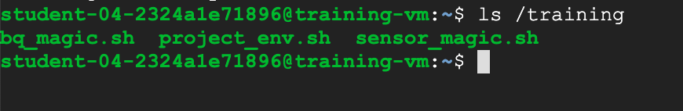

# Publish Streaming Data into Pub/Sub

## Task 1: Preparation

nav menu > compute engine > vm instances > 

| property          | value           | data 
| :------------ |:---------------:| :-----:|
|       name        | training-vm                 |       |
|     region          |     us-east4( Northern Virginia)            |       |
|      zone         |     us-east4-c            |       |
|      machine type     |     e2-medium          |     1 vCPU 3.75 GB memory  |
|        space |   10 gb 
|        OS  |   Debian GNU/Linux 10 (buster)  
| access scopes |   Allow full access to all Cloud APIs   
|firewall | no HTTP(S)


remote acccess > ssh 


figure out how to propely install the google.cloud.pubsub package as needed in cloud shell or vm

to see if the vm is setup 

```bash
ls /training
```


if you dont see this wait


then get the lab repo

```bash
git clone https://github.com/GoogleCloudPlatform/training-data-analyst
export DEVSHELL_PROJECT_ID=[name of project here]
```

## Task 2: Create Pub/Sub topic and subscription

```bash
cd ~/training-data-analyst/courses/streaming/publish
gcloud config set project [PROJECT_ID]

# machine 1
gcloud pubsub topics create sandiego
gcloud pubsub topics publish sandiego --message "hello"

# machine 2
gcloud pubsub subscriptions create --topic sandiego mySub1

# machine 1
gcloud pubsub topics publish sandiego --message "hello again"

# machine 2
gcloud pubsub subscriptions pull --auto-ack mySub1
gcloud pubsub subscriptions delete mySub1

# machine 1
gcloud pubsub topics delete sandiego
```

STOP HERE


## Task 3: Simulate traffic sensor data into Pub/Sub

look at the py script responsible

```bash
cd ~/training-data-analyst/courses/streaming/publish
nano send_sensor_data.py

./download_data.sh

./send_sensor_data.py --speedFactor=60 --project $DEVSHELL_PROJECT_ID
```


## Task 4: Verify that messages are received


nav menu > compute engine > vm instances > training vm 
remote acccess > ssh 


comfirm the topic is working 


```bash
cd ~/training-data-analyst/courses/streaming/publish

gcloud pubsub subscriptions create --topic sandiego mySub2
gcloud pubsub subscriptions pull --auto-ack mySub2


gcloud pubsub subscriptions delete mySub2
exit
```

go to the first terminal ctrl-c and close the window
